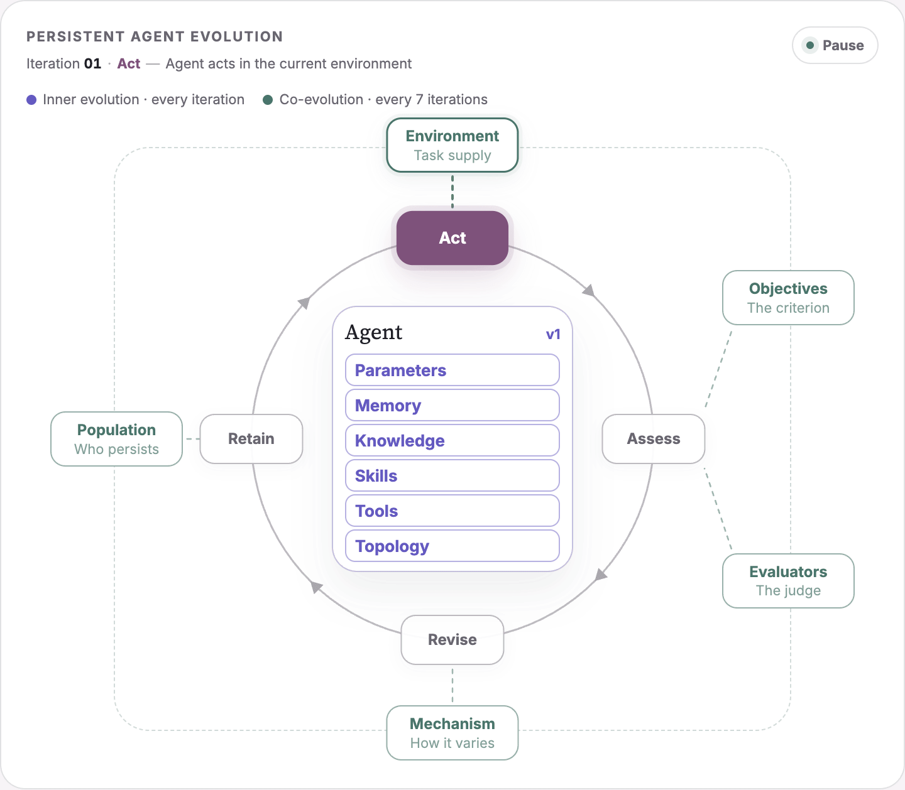

# Awesome Agentic Evolution

> From self-improving agents to co-evolving, open-ended agent ecosystems.

A community-curated index of agents that preserve improvements across attempts,
sessions, or generations. The collection maps what changes, what feedback drives
the change, what persists, and how the claimed improvement is evaluated.

[Explore the living research dashboard →](https://yuxinglu613.github.io/awesome-agentic-evolution/)

  

**Last editorial review:** 2026-07-31

## Contents

- [Scope](#scope)
- [Taxonomy](#taxonomy)
- [Start Here](#start-here)
- [Resource Map](#resource-map)
- [Benchmarks and Evaluation](#benchmarks-and-evaluation)
- [Articles and Technical Posts](#articles-and-technical-posts)
- [Related Awesome Lists](#related-awesome-lists)
- [Community and Long-Term Outputs](#community-and-long-term-outputs)
- [Contributing](#contributing)

## Scope

Agentic evolution requires a persistent update: an artifact changed during one
improvement cycle must influence future behavior. A resource is in scope when
it makes at least three elements legible:

1. the artifact being updated;
2. the feedback, reward, evaluator, or environmental signal driving the update;
3. the retained result and an evaluation showing whether it helped.

Generic agent frameworks, static retrieval systems, and one-shot
self-correction are out of scope unless they participate in a persistent
improvement loop. Benchmarks and evaluators are listed separately because they
measure evolution but do not necessarily evolve themselves.

## Taxonomy

The primary classification question is **which persistent artifact is edited**,
not which mechanism a paper uses or which application it studies.

- **Parameters:** model weights, policies, adapters, or other trainable state.
- **Memory:** agent-specific traces, reflections, summaries, and experience
  records retained across future attempts.
- **Knowledge:** external or decontextualized world knowledge, retrieval
  corpora, knowledge bases, schemas, and reusable factual assets.
- **Skills:** reusable procedural instructions, routines, and callable
  strategies for completing classes of tasks.
- **Tools:** executable interfaces, APIs, code modules, and expert agents the
  agent can invoke.
- **Topology:** prompts, routing, control flow, graph connectivity, role
  decomposition, and run-time orchestration.
- **Co-evolution:** coupled change in the agent and one or more external factors:
  objectives, evaluators, environments, update mechanisms, or populations.

Resources may have multiple targets, but each is listed once under its primary
target. The `Targets` line records other independently editable artifacts.
Implementation code is not a separate category: classify the behavioral
artifact that the code changes—for example, a generated tool under **Tools** or
a rewritten control graph under **Topology**.

**Boundary rule:** self-history belongs to **Memory**; externally reusable world
information belongs to **Knowledge**. When a system bundles both, annotate both
only if they can be updated independently.

## Start Here

- [Self-Improvements in Modern Agentic Systems: A Survey](https://arxiv.org/abs/2607.13104)
  — A 2026 system-level view of self-induced updates to foundation models and
  agent scaffolds.
- [A Survey of Self-Evolving Agents: What, When, How, and Where to Evolve](https://arxiv.org/abs/2507.21046)
  — Organizes the field by update target, timing, feedback, and application.
- [A Comprehensive Survey of Self-Evolving AI Agents](https://arxiv.org/abs/2508.07407)
  — Presents a feedback-loop perspective spanning models, workflows, and
  domain-specific evolution.
- [A Survey on Self-Evolution of Large Language Models](https://arxiv.org/abs/2404.14387)
  — Background on self-generated experience and parameter-level updates.

## Resource Map

Entries are grouped by their primary persistent target. Official repositories
are preferred as the main link; papers and first-party explanations are
attached to the same entry instead of being counted again.

### Parameters

- [STaR](https://arxiv.org/abs/2203.14465) — Iteratively generates successful
  rationales and updates model parameters on the retained examples.
  **Targets:** Parameters.
- [Self-Rewarding Language Models](https://arxiv.org/abs/2401.10020) — Uses the
  model as both instruction follower and judge during iterative training.
  **Targets:** Parameters.
- [AgentEvolver](https://github.com/modelscope/AgentEvolver) — Couples task
  generation, experience synthesis, and reinforcement learning for persistent
  agent improvement.
  **Targets:** Parameters, Memory, Co-evolution.

### Memory

- [Reflexion](https://github.com/noahshinn/reflexion) — [Paper](https://arxiv.org/abs/2303.11366).
  Stores verbal reflections in episodic memory for later trials.
  **Targets:** Memory.
- [ExpeL](https://github.com/LeapLabTHU/ExpeL) — [Paper](https://arxiv.org/abs/2308.10144).
  Distills transferable insights from successes and failures without updating
  model weights.
  **Targets:** Memory.
- [SelfMem](https://arxiv.org/abs/2607.03726) — Uses memory tools and feedback signals
  to evaluate and refine a reusable long-context memory strategy.
  **Targets:** Memory.
- [MemSkill](https://github.com/ViktorAxelsen/MemSkill) — [Paper](https://arxiv.org/abs/2602.02474).
  Learns memory-skill selection and evolves reusable routines from difficult
  cases.
  **Targets:** Memory, Skills.

### Knowledge

- [Adaptive Reflective Interactive Agent (ARIA)](https://aclanthology.org/2025.emnlp-industry.115/)
  — Maintains a timestamped knowledge repository from targeted human guidance,
  detects conflicts, and evaluates adaptation on changing-domain tasks.
  **Targets:** Knowledge.

### Skills

- [SkillOpt](https://github.com/microsoft/SkillOpt) — [Paper](https://arxiv.org/abs/2605.23904).
  Optimizes natural-language procedures from scored trajectories with
  validation-gated updates.
  **Targets:** Skills.
- [Voyager](https://github.com/MineDojo/Voyager) — [Paper](https://arxiv.org/abs/2305.16291).
  Grows an executable skill library through environment feedback and an
  automatic curriculum.
  **Targets:** Skills, Tools, Co-evolution.
- [MUSE-Autoskill](https://arxiv.org/abs/2605.27366) — Treats skills as
  testable, reusable assets that are refined across tasks.
  **Targets:** Skills.
- [SAGE](https://aclanthology.org/2026.acl-long.69/) — Accumulates a persistent
  skill library and trains skill generation and use with outcome-grounded
  rewards.
  **Targets:** Parameters, Skills.
- [From Memory to Skills](https://arxiv.org/abs/2607.16621) — Governs the
  evidence-grounded conversion of retained traces into callable skills.
  **Targets:** Memory, Skills.
- [Retrospective Harness Optimization](https://github.com/wbopan/retro-harness)
  — [Paper](https://arxiv.org/abs/2606.05922). Uses unlabeled past trajectories
  and self-preference to retain skill and tool updates that improve held-out
  behavior.
  **Targets:** Skills, Tools.

### Tools

- [Mem²Evolve](https://buaa-irip-llm.github.io/Mem2Evolve/) — [Paper](https://arxiv.org/abs/2604.10923).
  Couples experience distillation with dynamic creation of tools and expert
  agents.
  **Targets:** Memory, Skills, Tools, Co-evolution.

### Topology

- [ADAS](https://github.com/ShengranHu/ADAS) — [Paper](https://arxiv.org/abs/2408.08435).
  Searches agent designs expressed as code and retains an archive of evaluated
  candidates.
  **Targets:** Topology.
- [AgentSquare](https://github.com/tsinghua-fib-lab/AgentSquare) — [Paper](https://arxiv.org/abs/2410.06153).
  Searches a modular space of planning, reasoning, tool-use, and memory
  components.
  **Targets:** Memory, Skills, Tools, Topology.
- [GPTSwarm](https://github.com/metauto-ai/GPTSwarm) — [Paper](https://arxiv.org/abs/2402.16823).
  Represents language agents as graphs and optimizes node prompts and
  connectivity.
  **Targets:** Topology.
- [EvoAgentX](https://github.com/EvoAgentX/EvoAgentX) — Builds, evaluates, and
  evolves multi-agent workflows with pluggable optimization algorithms.
  **Targets:** Topology.
- [Darwin Gödel Machine](https://github.com/jennyzzt/dgm) — [Paper](https://arxiv.org/abs/2505.22954)
  · [Article](https://sakana.ai/dgm/). Rewrites coding-agent implementations
  and empirically validates descendants. Run only in an isolated sandbox.
  **Targets:** Skills, Tools, Topology.
- [A-Evolve](https://github.com/A-EVO-Lab/a-evolve) — Applies evolutionary
  search to agent implementations across domains.
  **Targets:** Topology.
- [OpenEvolve](https://github.com/algorithmicsuperintelligence/openevolve) —
  Provides an open evolutionary coding loop inspired by AlphaEvolve.
  **Targets:** Topology.
- [Agentic Evolution is the Path to Evolving LLMs](https://arxiv.org/abs/2602.00359)
  — Positions the agent scaffold as a primary target of evolution.
  **Targets:** Topology.

### Co-evolution

- [Double Ratchet](https://github.com/amazon-science/Self-Evolving-Agents-Double-Ratchet)
  — [Paper](https://arxiv.org/abs/2607.12790). Co-evolves an inspectable
  drawback-detector metric with a lifecycle-managed skill library, using
  anchored references and locked-set validation to expose evaluator collapse.
  **Targets:** Skills, Co-evolution.
- [Agent0](https://github.com/aiming-lab/Agent0) — [Paper](https://arxiv.org/abs/2511.16043).
  Co-evolves a task curriculum and a tool-using executor without human-curated
  task data.
  **Targets:** Tools, Co-evolution.

This section uses **Co-evolution** only when an external factor changes with the
agent. Multi-agent execution by itself is not sufficient.

## Benchmarks and Evaluation

These resources provide environments or held-out signals for testing whether a
persistent update is real.

- [RSIBench-Data](https://github.com/evolvent-ai/RSIBench-Data) —
  [Paper](https://arxiv.org/abs/2607.25886). Audits whether researcher agents
  turn checkpoint feedback into reusable training-data strategies under fixed
  training, evaluation, and budget controls.
- [Experience-driven Lifelong Learning](https://arxiv.org/abs/2508.19005) —
  Proposes a framework and benchmark for continuous agent growth.
- [SWE-bench](https://github.com/SWE-bench/SWE-bench) — Supplies real-world
  software issues used by self-improving coding-agent systems.
- [AgentBench](https://github.com/THUDM/AgentBench) — Evaluates agents across
  multiple interactive environments.
- [GAIA](https://huggingface.co/gaia-benchmark) — Tests assistants on tasks
  requiring reasoning, tools, and multimodal information.

For credible evolution claims, prefer:

1. a frozen held-out set that is not visible to the optimizer;
2. multiple seeds and learning curves, not only the best final run;
3. ablations separating extra inference compute from persistent improvement;
4. regression, safety, and capability-retention checks;
5. versioned artifacts with provenance, rollback, and rejected candidates.

## Articles and Technical Posts

- [AlphaEvolve: A Gemini-powered coding agent for designing advanced algorithms](https://deepmind.google/blog/alphaevolve-a-gemini-powered-coding-agent-for-designing-advanced-algorithms/)
  — A first-party description of an evolutionary loop combining proposals with
  automated evaluators.
- [AlphaEvolve: How our coding agent is scaling impact across fields](https://deepmind.google/blog/alphaevolve-impact/)
  — A 2026 first-party update on deployments and scientific applications.
- [LLM Powered Autonomous Agents](https://lilianweng.github.io/posts/2023-06-23-agent/)
  — A foundation for reflection, memory, planning, and tool use.

## Related Awesome Lists

- [Awesome Self-Evolving Agents — EvoAgentX](https://github.com/EvoAgentX/Awesome-Self-Evolving-Agents)
- [Awesome Self-Evolving Agents — XMUDeepLIT](https://github.com/XMUDeepLIT/Awesome-Self-Evolving-Agents)
- [Awesome Self-Improving Agents](https://github.com/selfimproving-agent/Awesome-Self-Improving-Agents)
- [Awesome Self-Evolution of LLM](https://github.com/AlibabaResearch/DAMO-ConvAI/tree/main/Awesome-Self-Evolution-of-LLM)

## Community and Long-Term Outputs

The repository is community-first and is building a structured evidence base.
The evidence may support a living survey and conference tutorial after the
public maturity gates in the [Roadmap](ROADMAP.md) are met.

- [Call for Contributors](CALL_FOR_CONTRIBUTORS.md)
- [Community Roles and Governance](COMMUNITY.md)
- [Roadmap](ROADMAP.md)

Repository contributions are credited publicly. Sustained, substantive work in
curation, reproducibility, analysis, writing, software, visualization, or
revision can qualify contributors for survey-paper authorship. Decisions follow
transparent CRediT-style roles rather than maintainer status.

## Contributing

Suggestions and pull requests are welcome. Read
[CONTRIBUTING.md](CONTRIBUTING.md) before submitting a resource.

This index favors evidence over hype. A large star count is neither necessary
nor sufficient; a resource should make the update target, feedback loop,
persistent artifact, and evaluation legible.

## License

[MIT](LICENSE)
